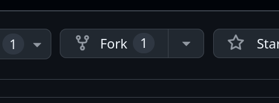
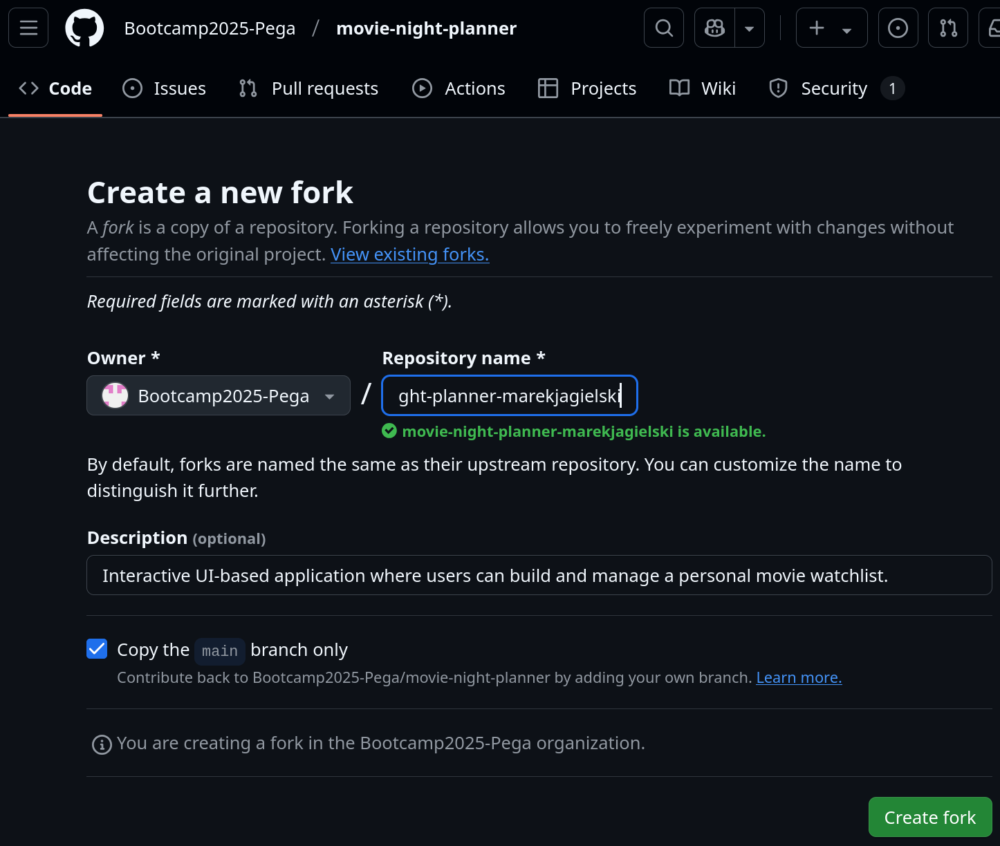
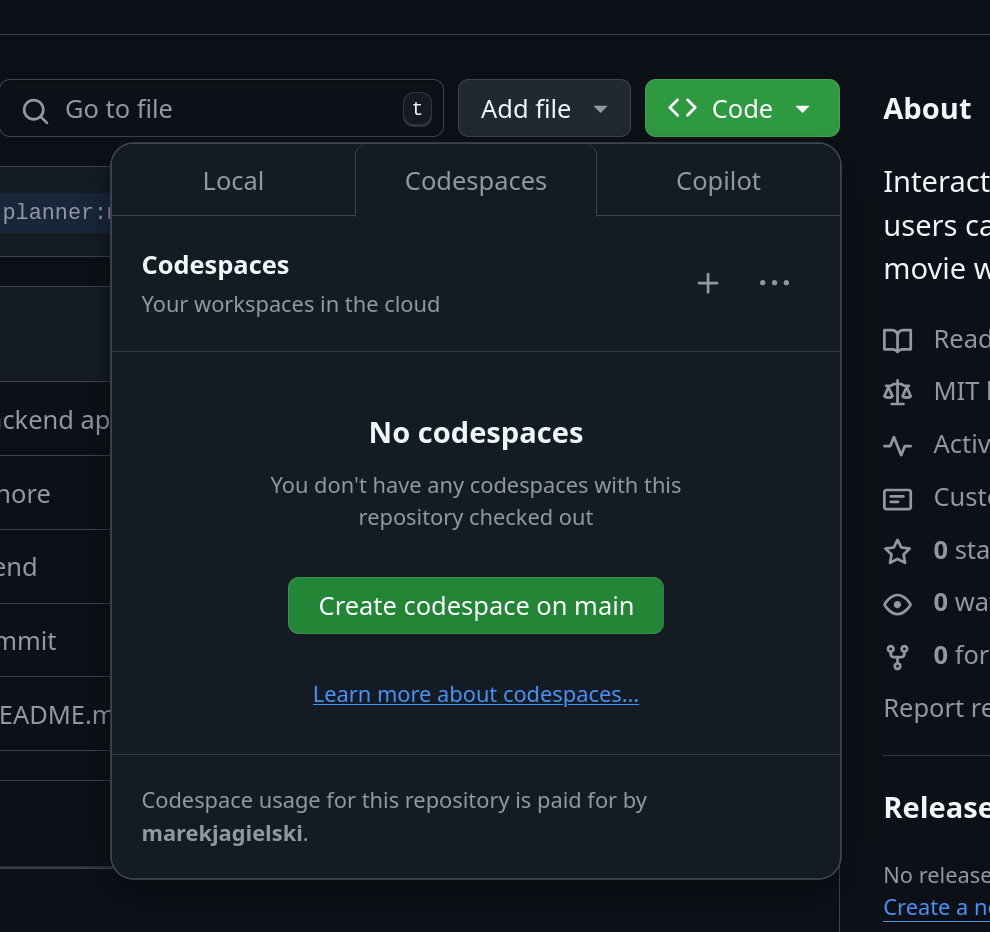
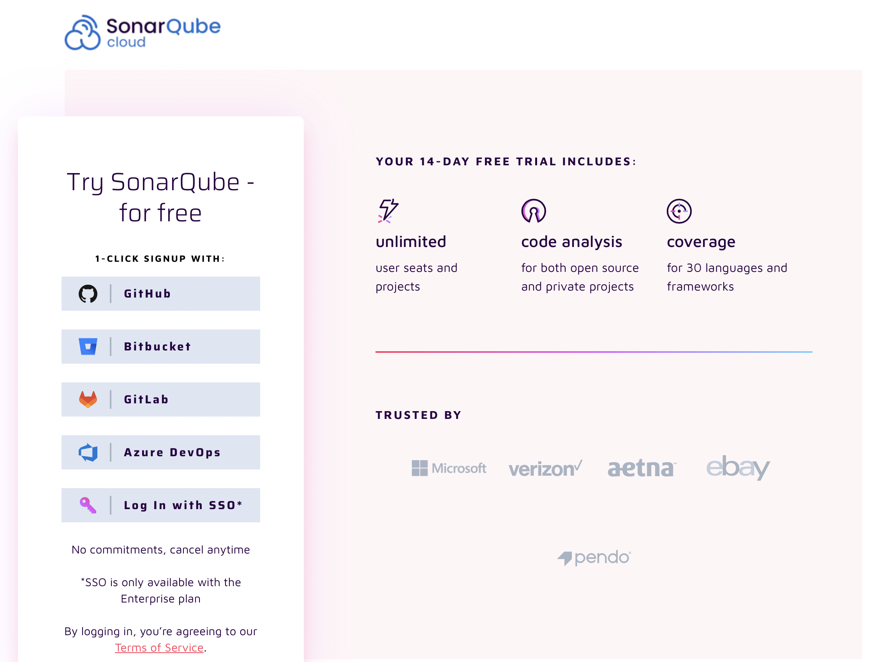
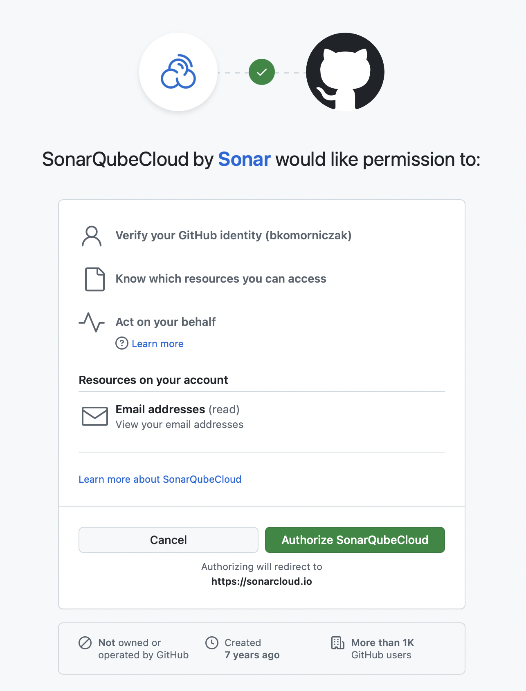
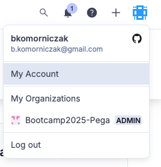
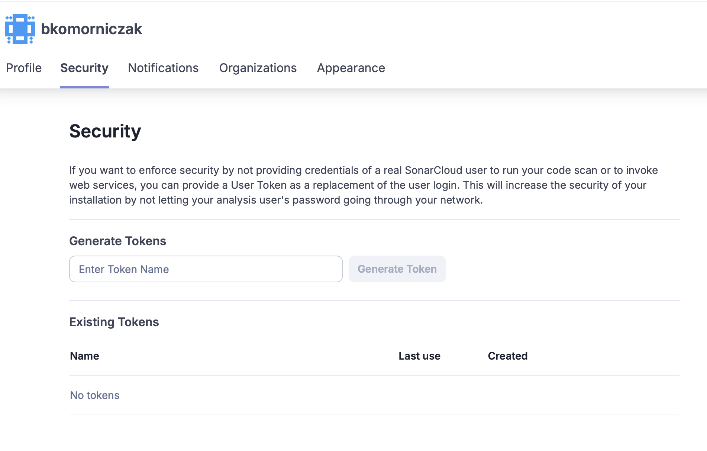
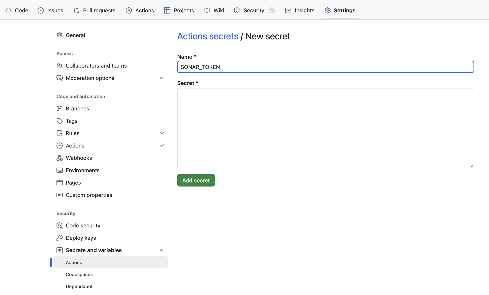

# DevOps in Action: A Hands-On Guide to Building a Modern SDLC

Welcome to the DevOps Bootcamp! This bootcamp is designed to give you hands-on experience with setting up a standard Software Development Life Cycle (SDLC) for a simple application, using GitHub, GitHub Actions, and other free-tier DevOps tools. Over the course of this 3-hour interactive session, you’ll learn how to:

* Create and manage a GitHub repository.
* Implement Continuous Integration and Continuous Delivery (CI/CD) pipelines.
* Deploy applications to free-tier service.

# 1. Requirements

## 1.1. Prerequisites

* Basic command-line skills: Comfort with navigating directories and running simple commands in a terminal.
* Git & GitHub basics: Understanding of how to clone a repository, commit changes, and push to a remote branch.

## 1.2. Materials

* A laptop.
* A GitHub account (free).
  
  During the workshop we will work on GitHub Codespaces. This ensures everyone has a uniform environment, reducing setup issues.

## 1.3. Technical Setup

Before the bootcamp starts, please ensure the following:

* GitHub Account
  
  Create a free GitHub account if you don’t already have one.

* Share your GitHub username with the Bootcamp organizers so they can add you to the Bootcamp2025-Pega organization.

# 2. Agenda

## 2.1. High-level

Below is a high-level breakdown of the 3-hour bootcamp session:
* Introduction to DevOps and the SDLC
* GitHub Repository and Environment Setup
* Implementing CI/CD with GitHub Actions
* Deploying to a Free-Tier Service

## 2.2. Daily Schedule (3-Hour Workshop)

| Time (Approx.) | Activity                                |
| -------------- | --------------------------------------- |
| 0:00 - 0:10    | Welcome                                 |
| 0:10 - 0:20    | [SDLC Overview](https://bootcamp2025-pega.github.io/instructions/) |
| 0:20 - 0:30    | GitHub Repository and Environment Setup |
| 0:30 - 2:00    | Implementing CI/CD with GitHub Actions  |
| 2:00 - 2:30    | Deployment                              |
| 2:30 - 2:40    | Summary & Closing Remarks               |

# 3. Steps to Follow

## 3.1. Module 1: DevOps & SDLC Overview

## 3.2. Module 2: Setting Up a GitHub Repository

1.  **Navigate to the Bootcamp Organization**

  *   Go to the [Bootcamp2025-Pega organization on GitHub](https://github.com/Bootcamp2025-Pega).
  *   If you've provided your GitHub username to the organizers, you should already be a member. If not, please inform the organizers to be added.
  
2.  **Navigate to the Instructions Repository**

  *   For detailed instructions, refer to the [instructions repository](https://github.com/Bootcamp2025-Pega/instructions). This is the document you are currently reading.

3.  **Navigate to the movie-night-planner application repository**

  *  Please see [movie-night-planner repository](https://github.com/Bootcamp2025-Pega/movie-night-planner). This is a repository with the application we will be working on. This is an interactive UI-based application where users can build and manage a personal movie watchlist.

4. **Create your own fork of movie-night-planner repository**

   * 1. **Click the "Fork" button:**  In the top-right corner of the repository page, click the "Fork" button.
  
   * 3. **Select the organization:** Choose the organization **Bootcamp2025-Pega** to fork the repository into.
   * 4. **Rename the repository:** In the "Repository name" field, enter the name for the forked repository, following the pattern `movie-night-planner-{username}`, replacing `{username}` with your GitHub username.
  
   * 5. **Create the fork:** Click the "Create fork" button.

5. **Navigate to your repository and get familiar with project**

  * 1. **Navigate to your forked repository:** Go to your personal fork of the `movie-night-planner` repository (named `movie-night-planner-{username}`) on GitHub.
  * 2. **Explore the codebase:** Familiarize yourself with the project structure, files, and code. Pay attention to the `README.md` file, which provides an overview of the application.

6. **Run application in Codespaces**

    * 1.  **Open Codespaces:** Navigate to your forked `movie-night-planner-{username}` repository on GitHub. Click on the green "Code" button.
    * 2.  **Create new Codespace:** Select the "Codespaces" tab and click on "Create codespace on main". This will start a new cloud-based development environment.
    
    * 3.  **Wait for Codespace to initialize:** GitHub will set up a virtual machine and automatically clone your repository into it. This process may take a few minutes.
    * 4.  **Run the application:** Once the Codespace is ready, navigate to a terminal. Run commands:
    ```bash
    # Run backend
    cd backend && docker-compose up
    # Run frontend
    cd .. && npm run dev
    ```
    
    **TODO**
    
    * 5.  **Access the application:** Once the application is running, Codespaces will provide a URL to access it. Check the terminal output for the URL. Click on the URL to open the application in a new browser tab.
     (**TODO**).

## 3.3. Module 3: Implementing CI/CD with GitHub Actions

# TODO

### 3.3.1. Basic build pipeline

Goal: Create basic pipeline that builds project and execute tests.

1.  **Create a base workflow**


  
### 3.3.2. Execute Unit Tests

### 3.3.3. Verify pull request

### 3.3.4. Static Code Analysis
#### **SonarCloud**
SonarCloud is a cloud-based service designed to continuosly inspect your cose for quality and security issues. What it does:
* Code Quality Analisys: scans code to detect bugs, code smells, and vulnerabilities
* Integration: easy integration with CI/CD pipelines, and tools like Github, Bitbucket, Azure DevOps
* Pull Request decoration: It can provide comments on pull requests with summary of its results
* Dashboard: Detailed dashboard is available

#### **Integrate SonarCloud to your project**
In order to integrate Sonar into your project follow those steps:
1. Go to SonarCould [login page](https://sonarcloud.io/login)
2. Choose login with Github

3. Grand SonarQubeCloud necessary permissions

4. Connect to bootcamp org //TODO!
5. Generate token. In order to connect Github and Sonar you need to generate token:
* First go to My Account

* Go to Security tab, enter token name of your choosing, generate token

6. Now you need to add token to Github secrets. Enter name and contents of your secret.

7. You are all set!


### 3.3.5. Test Coverage

### 3.3.6. ...

### 3.3.6. Static Application Security Testing (SAST)

### 3.3.7. Software Composition Analysis (SCA)

### 3.3.8. ...

## 3.4 Module 4: Deployment to Free-Tier Service

### 3.4.1. TODO

